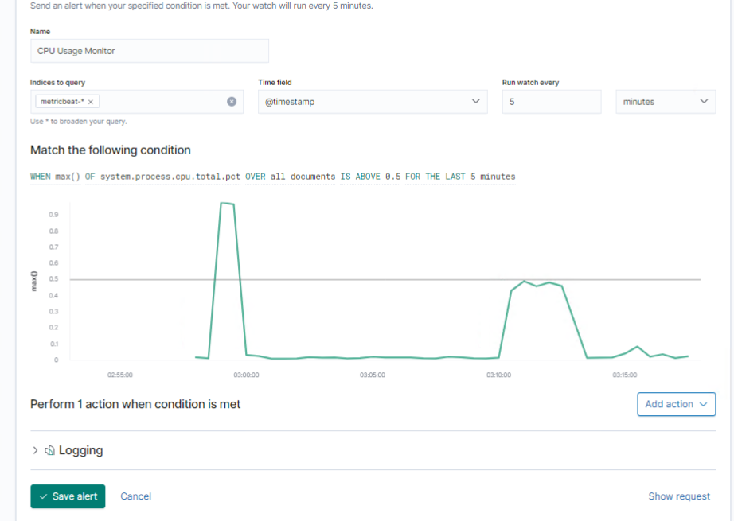
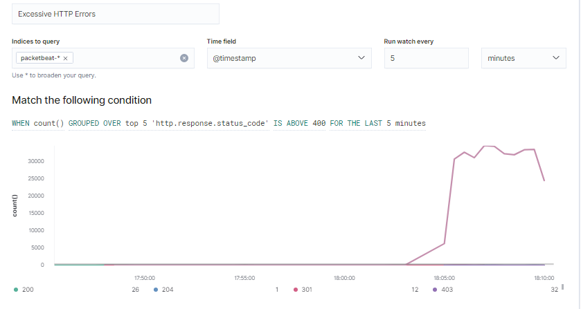
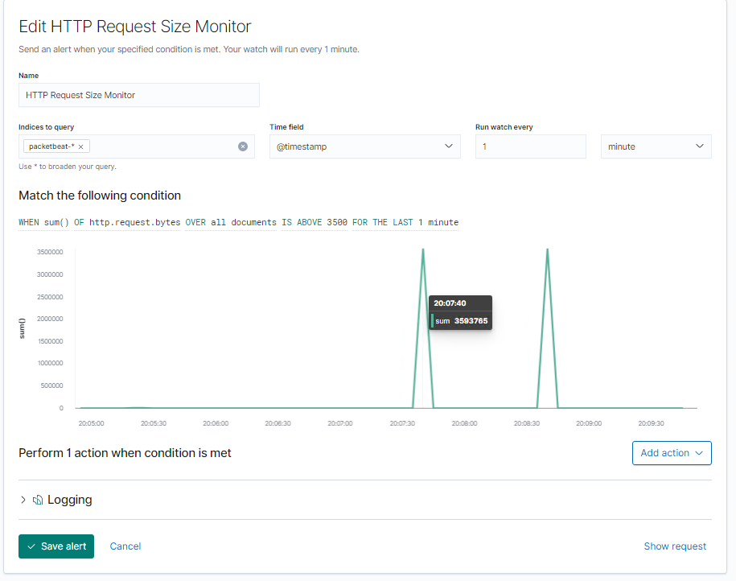
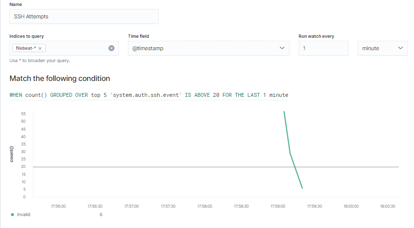

# Blue Team: Summary of Operations

## Table of Contents
- Network Topology
- Description of Targets
- Monitoring the Targets
- Patterns of Traffic & Behavior
- Suggestions for Going Further

### Network Topology
_TODO: Fill out the information below._

The following machines were identified on the network:
- CAPSTONE (This machine was located within the network but not utilized during the attack.)
  - **Operating System**: Linux
  - **Purpose**: Test alerts and forward logs to the ELK Machine.
  - **IP Address**: 192.168.1.105
- ELK
  - **Operating System**: Linux
  - **Purpose**: Centralized logging location for data.
  - **IP Address**: 192.168.1.100
- KALI
  - **Operating System**: Linux
  - **Purpose**: Penetration testing machine
  - **IP Address**: 192.168.1.90
- TARGET 1
  - **Operating System**: Linux
  - **Purpose**: Victim machine with a vulnerable WordPress server.
  - **IP Address**: 192.168.1.110
- TARGET 2 (This machine was located within the network but not utilized during the attack.)
  - **Operating System**: Linux
  - **Purpose**: Vulnerable machine
  - **IP Address**: 192.168.1.115

### Description of Targets

The target of this attack was: `Target 1` (IP:192.168.1.110).

Target 1 is an Apache web server and has SSH enabled, so ports 80 and 22 are possible ports of entry for attackers. As such, the following alerts have been implemented:

### Monitoring the Targets

Traffic to these services should be carefully monitored. To this end, we have implemented the alerts below:

#### CPU Usage Monitor

Alert 1 is implemented as follows:
  - **Indices to Query**: MetricBeat-*
  - **Metric**: WHEN max () OF system.process.cpu.total.pct OVER all documents
  - **Threshold**:  IS ABOVE 0.5 FOR THE LAST 5 minutes
  - **Vulnerability Mitigated**: Malicious programs running in the background.
  - **Reliability**: This alert is highly reliable. Although there were a few false positives created, this allows for the user to investigate what programs are consuming large amount of resource on their device so adjustments can be made to increase overall performance of the machine.

#### Excessive HTTP Errors
Alert 2 is implemented as follows:
  - **Indices to Query**: PacketBeat-*
  - **Metric**: WHEN count () GROUPED OVER top 5 'http.response.status_code'
  - **Threshold**: IS ABOVE 400 FOR THE LAST 5 minutes
  - **Vulnerability Mitigated**: Enumeration and Brute Force Attacks
  - **Reliability**: This alert has low reliablity. There were no alerts triggered when the attacker enumerated the users within the WordPress site using wpscan or when Michael's password was brute-forced with hydra. Only when a very aggressive scan occurred (i.e. dirb) did the alert trigger.

#### HTTP Request Size Monitor
Alert 3 is implemented as follows:
  - **Indices to Query**: PacketBeat
  -  **Metric**: WHEN sum () OF http.request.bytes OVER all documents
  - **Threshold**: IS ABOVE 3500 FOR THE LAST 1 minute
  - **Vulnerability Mitigated**: Enumeration and Distributed Denial of Service (DDoS)
  - **Reliability**: This alert has medium reliability. The alert triggered (false positive) during normal user activity as well as when an attack was occurring.
 
#### SSH Request Size Monitor
Alert 4 is implemented as follows:
  - **Indices to Query**: Filebeat
  -  **Metric**: WHEN count() GROUPED OVER top 5 'system.auth.ssh.event'
  - **Threshold**: IS ABOVE 20 FOR THE LAST 1 minutes
  - **Vulnerability Mitigated**: User Enumeration and Excessive SSH Login Attempts
  - **Reliability**: This alert is highly reliable. 
 
### Suggestions for Going Further

The logs and alerts generated during the assessment suggest that this network is susceptible to several active threats, identified by the alerts above. In addition to watching for occurrences of such threats, the network should be hardened against them. The Blue Team suggests that IT implement the fixes below to protect the network:
- Vulnerability 1: CPU Usage Improvements
  - **Patch**: 
1. Install Anti-Viral/Anti-Malware Software
2. Install Host-based Intrusion Detection System (HIDS)
3. Perform Regular Optimization Scans
  - **Why It Works**: 
1. Ensures that computer has not been compromised and will remove malicous programs.
2. HIDS give the user a historical record of the activiy occuring on the device. This allows for the identification of abnormal patterns within the system that may not trigger alerts.
3. Performing optimization scans on devices allows your device to reconfigure how data is stored within the computer which ultimately take strain off of the system keeping the cpu usage lower and increases the performance of the device.
- Vulnerability 2: Enumeration of Users
  - **Patch**:
1. Remove Ability to Enumerate Through Author Archives 

2. Install Regular Updates to Website
  - **Why It Works**:
    1. By inserting the code listed above into the website's functions.php file (reference: https://medium.com/@ahmed_elhady/wordpress-username-enumeration-techniques-2ca0510df632), this removes the ability to enumerate users with both wpscan and through author archives (http://192.168.1.110/wordpress/?author=1).
    2. By ensuring updates are performed regularly, any vulnerabilities found can be patche which reduces the likelihood of an attacker being able to exploit weaknesses.
- Vulnerability 3: HTTP Request Size Monitor
  - **Patch**:
    1. Install Network Intrustion Detection System (NIDS)
    2. Configure Request Limits: Max Request Length, Max URL Lengths, Max Number of Cookies, Max Header Length Value, etc.
  - **Why It Works**:
    1. NIDSs monitor network traffic and will create alerts if suspicious activity is detected. Although Network Intrustion Prevention Systems (NIPSs) are an anvatageous choice, NIDSs only alert of the suspicious activity and allow administrators to determine whether or not the traffic is malicious. This is ideal in a business since because NIPSs have the potential to deny suspicious, but ultimiately nonmalicious traffic which could have a negative impact on the company.
    2. By creating request limits specialized for the system's needs, if malicious actors try to exceed these limits they will receive a 404 message and be denied of that action. These error messages will be be logged as a substatus messages (i.e. 404.14=URL Too Long, 404.15=Query String Too Long, etc.) which will allow investigators to analyze the attackers attempted methods of exploitation.
 - Vulnerability 4: SSH Request Size Monitor
  - **Patch**:
    1. Limit which users are allowed to login via SSH by editing the /etc/ssh/ssh_configd file. (Mitre Att&ck: M1018)
    2. Implement Multi-Factor Authenification Protocols (Mitre Att&ck: M1032)
  - **Why It Works**:
    1. By limiting the number of users allowed to login remotely, this will decrease the attack surface that unauthenticated users can exploit.
    2. The more layers of defense used to protect a system not only provides more obstacles for an attacker to access sensitive data, but also allows analysts more time to notice unusual patterns occurring and possible stop the attack.