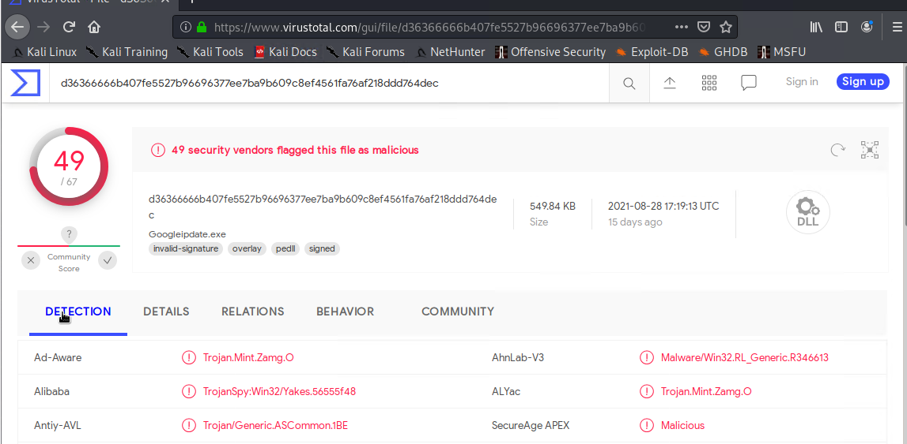

## Network Analysis
#

#### Time Thieves

At least two users on the network have been wasting time on YouTube. Usually, IT wouldn't pay much mind to this behavior, but it seems these people have created their own web server on the corporate network. So far, Security knows the following about these time thieves:

- They have set up an Active Directory network.
- They are constantly watching videos on YouTube.
- Their IP addresses are somewhere in the range `10.6.12.0/24`.

You must inspect your traffic capture to answer the following questions in your Network Report:
1. What is the domain name of the users' custom site? `frank-n-ted.com`
    
2. What is the IP address of the Domain Controller (DC) of the AD network? `10.6.12.12`
    
3. What is the name of the malware downloaded to the 10.6.12.203 machine? `june11.dll`
    
    
   - Once you have found the file, export it to your Kali machine's desktop.
    **Export Path:** `File`> `Export Objects` > `Save All`
4. Upload the file to [VirusTotal.com](https://www.virustotal.com/gui/).
    
5. What kind of malware is this classified as? `Trojan Malware`

#### Vulnerable Windows Machines

The Security team received reports of an infected Windows host on the network. They know the following:
- Machines in the network live in the range `172.16.4.0/24`.
- The domain mind-hammer.net is associated with the infected computer.
- The DC for this network lives at `172.16.4.4` and is named Mind-Hammer-DC.
- The network has standard gateway and broadcast addresses.

Inspect your traffic to answer the following questions in your network report:

1. Find the following information about the infected Windows machine:
    - Host name: `ROTTERDAM-PC$
    
    - IP address: `172.16.4.205`
    - MAC address: `00:59:07:b0:63:a4`
    
2. What is the username of the Windows user whose computer is infected? `matthijs.revries`
    
3. What are the IP addresses used in the actual infection traffic? `185.243.115.84 and 166.62.111.64`
    
4. As a bonus, retrieve the desktop background of the Windows host.
    
#### Illegal Downloads

IT was informed that some users are torrenting on the network. The Security team does not forbid the use of torrents for legitimate purposes, such as downloading operating systems. However, they have a strict policy against copyright infringement.

IT shared the following about the torrent activity:

- The machines using torrents live in the range `10.0.0.0/24` and are clients of an AD domain.
- The DC of this domain lives at `10.0.0.2` and is named DogOfTheYear-DC.
- The DC is associated with the domain dogoftheyear.net.

Your task is to isolate torrent traffic and answer the following questions in your Network Report:

1. Find the following information about the machine with IP address `10.0.0.201`:
    - MAC address: `00:16:17:18:66:c8`
    - Windows username: `elmer.blanco`
    
    - OS version: `Windows NT 10.0`

2. Which torrent file did the user download? `Betty_Boop_Rhythm_on_the_Reservation.avi.torrent`
    