# Red Team: Summary of Operations

## Table of Contents
- Exposed Services
- Critical Vulnerabilities
- Exploitation

### Exposed Services

Nmap scan results for each machine reveal the below services and OS details:
###### **Command Used:**`$ nmap -sV 192.168.1.110`
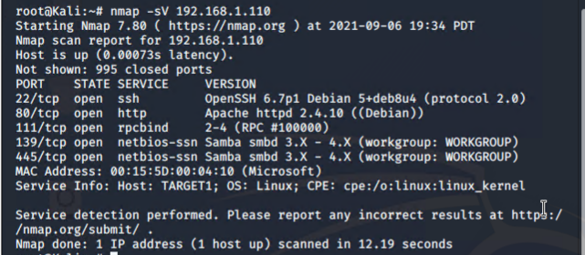

This scan identifies the services below as potential points of entry:
##### Target 1:

|   PORT  	| STATE 	|   SERVICE   	|                    VERSION                   	|
|:-------:	|:-----:	|:-----------:	|:--------------------------------------------:	|
|  22/tcp 	|  OPEN 	|     ssh     	| OpenSSH 6.7p1 Debian 5+deb8u4 (protocol 2.0) 	|
| 80/http 	|  OPEN 	|     http    	|        Apache httpd 2.4.10 ((Debian))        	|
| 111/tcp 	|  OPEN 	|   rpcbind   	|               2-4 (RPC #100000)              	|
| 139/tcp 	|  OPEN 	| netbios-ssn 	|   Samba smbd 3.X-4.X (workgroup: WORKGROUP)  	|
| 445/tcp 	|  OPEN 	| netbios-ssn 	|   Samba smbd 3.X-4.X (workgroup: WORKGROUP)  	|

The following vulnerabilities were identified on each target:
##### Target 1:

|  VULNERABILITY 	| CVE NUMBER 	|   SEVERITY     	|    VULNERABILITY DESCRIPTION                   	|
|:-------:	|:-----:	|:-----------:	|:--------------------------------------------:	|
|  Username Enumeration	|CVE-2017-5487  |     Medium (CVSS Score: 5.3)     	|  Allows for unauthorized actors to access sensitive information without proper authorization.	|
| Weak Password Requirements 	|  CWE-521 	|     Medium-High    | Users lack minimal password requirements which increase the risk of attackers gaining access to accounts within the system.        	|
| Weak Password Encryptions (Salting) 	|     CVE-2020-5229	|   Severe (CVSS Score: 8.1   	|   Using weak or outdated hashing algorithm for storing passwords.            	|
| Exploitation for Privilege Escalation 	|  CVE-2006-0151 | High-Severe	|   The misconfiguration of user priveleages that leads to local users gaining higher privileges by running a Python script.  	|

_TODO: Include vulnerability scan results to prove the identified vulnerabilities._

### Exploitation

The Red Team was able to penetrate `Target 1` and retrieve the following confidential data:
##### Target 1
The first sensitive document,`flag1.txt`, was found by searching through the page source information of the Service page of the website `http://192.168.1.110/service.html`.
#
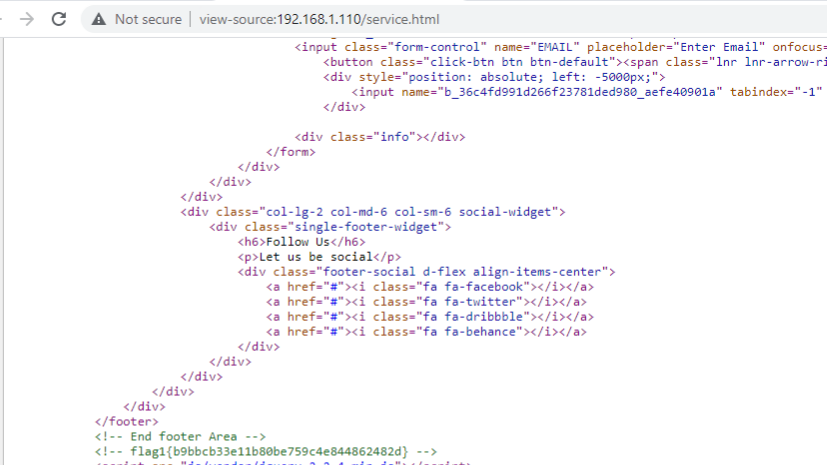

Next, the Red Team enumerated the users within the Wordpress site with the WPScan Wordpress Security Scanner.
**Command:** `wpscan --url http://192.168.1.110/wordpress --enumerate u`
#
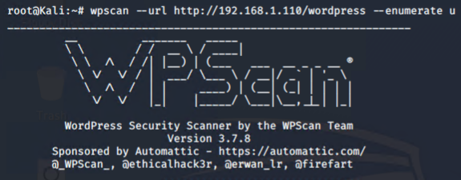

This command listed two users within the Wordpress site: `michael` and `steven`.
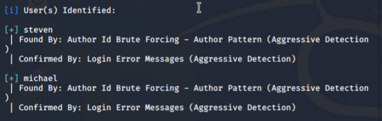

With this information, Michael's account was able to be accessed via SSH due to the simplicity of his password. His password was `michael`.
**Commands:** `ssh michael@192.168.1.110`;`yes`;`michael`

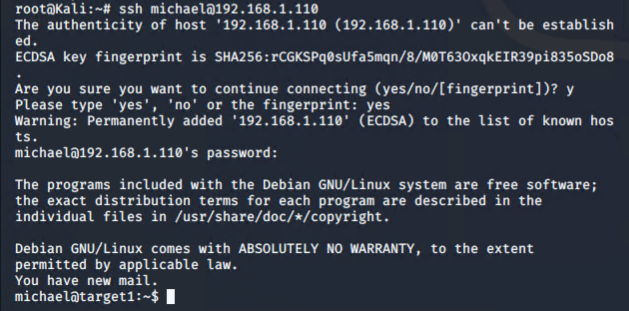

Once logged in as Michael, the second sensitive document,`flag2.txt`, was exposed within the /var/www/ directory.
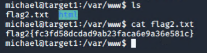

The document flag1.txt could be access again by navigating to the /var/www/html directory.
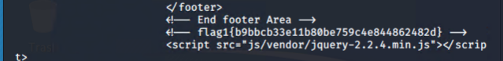

From this point, the Red Team navigated to the `wp_config.php` file to obtain the MYSQL database password.
#
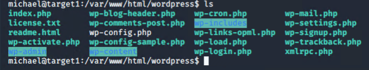 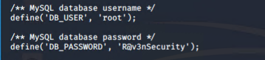

With the MySQL database credentials, the Red Team was able to extract the password hashes of both Michael and Steven using the following commands:
`mysql -h localhost -u root -pR@v3nSecurity`
#

`show databases;`;`use wordpress;`;`show tables;`;`SELECT * FROM wp_users;`OR `SELECT ID, user_login, userpass FROM wp_users`
#
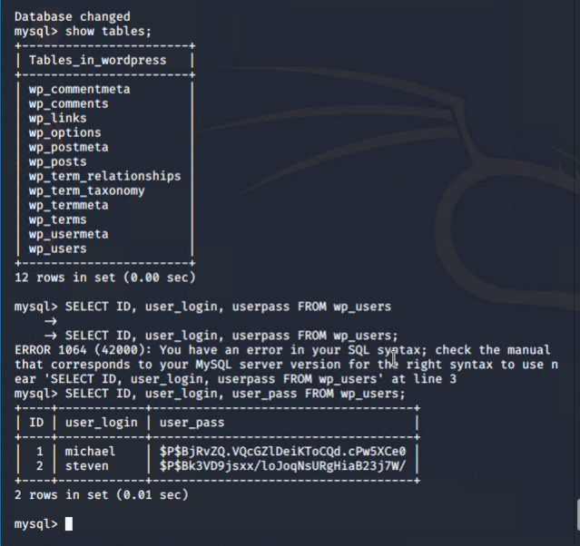
#
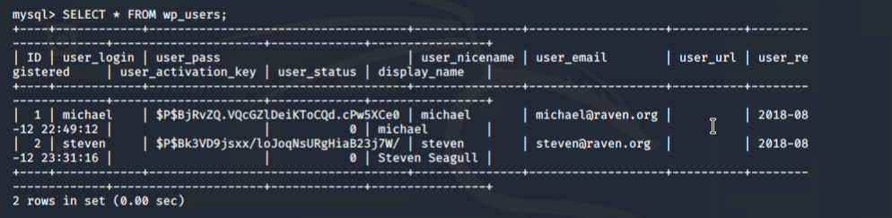